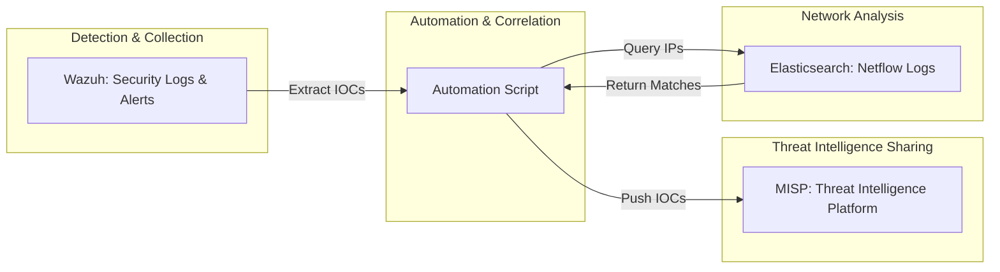
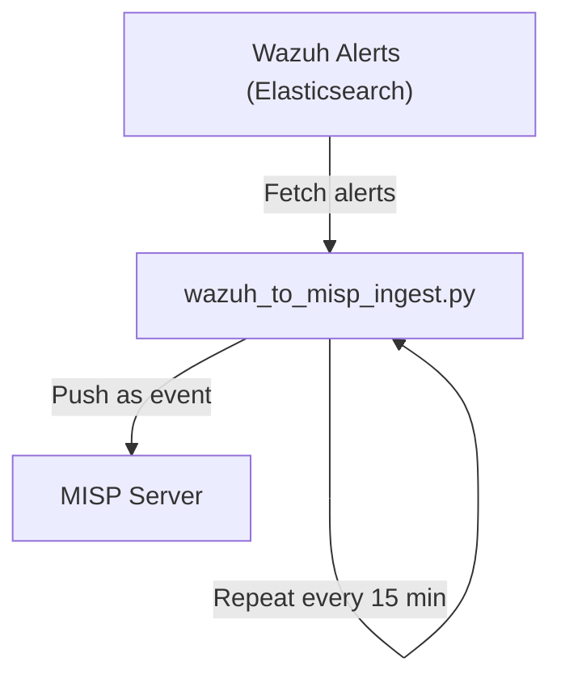

# CTI Automation with Wazuh, MISP, and Netflow

## Project Background

Modern enterprise networks and data centers have grown in both size and complexity. With hundreds of applications running on distributed Virtual Machines (VMs) and cloud platforms, the attack surface is large and constantly changing. This presents several key challenges for security teams:

- **Challenge 1: Siloed Detection**  
  Security tools like Wazuh can detect suspicious activity on individual machines or applications, but these alerts are often isolated. As a result, it’s hard to spot patterns—such as the same attacker targeting multiple systems across the network.

- **Challenge 2: Slow Threat Intelligence Sharing**  
  When Indicators of Compromise (IOCs)—like malicious IP addresses—are detected, they need to be shared quickly with all relevant teams and systems. Delays can give attackers more time to move laterally or attack other assets.

- **Challenge 3: Limited Network Visibility**  
  Even if an attacker is identified on one system, it's difficult to know if they have tried to access or have already compromised other systems without comprehensive network traffic analysis.

### Solution Overview
---

This project solves these problems by automating the collection and sharing of IOCs, and by correlating endpoint detections with network activity:


1. **Automated IOC Extraction:**  
   When Wazuh detects suspicious activity, the relevant IOCs (like attacker IPs) are automatically extracted.

2. **Real-Time Sharing with MISP:**  
   These IOCs are immediately shared with MISP (Malware Information Sharing Platform), so threat intelligence is updated in real time and available to all connected teams and tools.

3. **Network Correlation via Elasticsearch:**  
   The solution checks internal Netflow logs (stored in Elasticsearch) to see if the attacker IP has tried to access other systems, helping to identify broader attack campaigns or lateral movement.

This integrated approach enables faster incident detection, better visibility, and more effective response.

---

## Solution Architecture

Below is a high-level diagram showing how the system works:



## Required Components

Ensure the following are in place before setup:

- **Wazuh Manager:** Collects/analyzes security events; alerts are stored as indices in Elasticsearch.
- **MISP Instance:** Receives IOCs from Wazuh alerts for real-time threat intelligence sharing.
- **Netflow Log Collection in Elasticsearch:** Stores Netflow logs to cross-verify attacker IPs.
---

## Automated IOC Extraction and MISP Integration

The core of this project is the [`wazuh_to_misp_ingest.py`](wazuh_to_misp_ingest.py) script, which automates the extraction of Indicators of Compromise (IOCs) from Wazuh alerts stored in Elasticsearch and shares them as structured events with your MISP instance.

### How the Script Works

- **Configurable Connections:**  
  The script connects securely to your Elasticsearch (where Wazuh alerts are stored) and your MISP instance using API keys and credentials.

- **Smart Tracking:**  
  It keeps track of which events have already been pushed using local files, ensuring only new and unique IOCs are sent to MISP.

- **Alert Query & Grouping:**  
  - Fetches recent alerts from Wazuh indices in Elasticsearch, focusing on web-access logs with attacker IPs, URLs, and MITRE ATT&CK context.
  - Groups alerts by source IP, collecting all URLs, MITRE tactics/techniques, and geolocation info for each attacker.

- **Event Creation in MISP:**  
  - For every new attacker IP (not previously pushed), it creates a MISP event with:
    - Source IP as `ip-src`
    - All suspicious/malicious URLs as `url` attributes
    - MITRE tactic & technique, geo data, and relevant tags
  - Publishes the event to MISP via its API

- **Runs Automatically:**  
  By default, the script runs in a loop, updating MISP every 15 minutes with any new threats detected.

### Example Configuration

Edit the script variables  [`wazuh_to_misp_ingest.py`](wazuh_to_misp_ingest.py) or set environment variables as follows:

```env
MISP_URL=https://your-misp-server-url
MISP_KEY=YOUR_MISP_API_KEY
ES_HOST=https://your-elasticsearch-host:9200
ES_USER=your-es-username
ES_PASS=your-es-password
```

### Usage

To start the automation, simply run:

```bash
python3 wazuh_to_misp_ingest.py
```

The script will continue running, periodically checking for new alerts and pushing them to MISP.

### Workflow Diagram

### Security Note

- In production, enable SSL certificate verification and restrict access to the script.

---

This script is the core bridge between detection in Wazuh and actionable sharing in MISP, enabling real-time, automated threat intelligence across your network.


---

## Proof-of-Concept (POC) Steps

This section demonstrates the end-to-end workflow of IOC extraction and sharing, with key screenshots from each stage:

### 1. Detection in Wazuh Dashboard

*Wazuh dashboard displaying detections from web access logs (e.g., suspicious requests, attacker IPs, MITRE mapping).*


---

### 2. Execution of the Script

*Running the `wazuh_to_misp_ingest.py` script and its output in the terminal, showing successful IOC extraction and event pushes to MISP.*


---

### 3. Event Creation in MISP Portal

*Viewing the newly created event in the MISP portal, with IOCs, attributes, tags, and associated threat context.*


---


---


## Additional Notes

- Tested with **Elasticsearch 7.17.13** and **Wazuh App version 4.53**.
- For newer Wazuh versions, please review/adjust configurations as needed.

---

## Contributing / Support

_Explain how users can contribute or get help._

---

## License

_Provide your license information here (e.g., MIT, Apache 2.0, etc.)._

---

**Fill in the code, configuration, and diagram sections as needed. All previous images are preserved as requested.**
