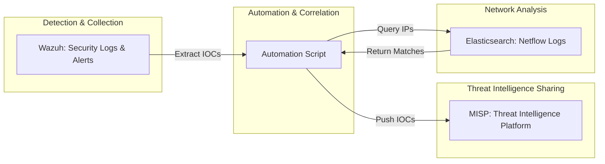

# CTI Automation with Wazuh, MISP, and Netflow

## Project Background

Modern enterprise networks and data centers have grown in both size and complexity. With hundreds of applications running on distributed Virtual Machines (VMs) and cloud platforms, the attack surface is large and constantly changing. This presents several key challenges for security teams:

- **Challenge 1: Siloed Detection**  
  Security tools like Wazuh can detect suspicious activity on individual machines or applications, but these alerts are often isolated. As a result, it’s hard to spot patterns—such as the same attacker targeting multiple systems across the network.

- **Challenge 2: Slow Threat Intelligence Sharing**  
  When Indicators of Compromise (IOCs)—like malicious IP addresses—are detected, they need to be shared quickly with all relevant teams and systems. Delays can give attackers more time to move laterally or attack other assets.

- **Challenge 3: Limited Network Visibility**  
  Even if an attacker is identified on one system, it's difficult to know if they have tried to access or have already compromised other systems without comprehensive network traffic analysis.

### Solution Overview
---

This project solves these problems by automating the collection and sharing of IOCs, and by correlating endpoint detections with network activity:


1. **Automated IOC Extraction:**  
   When Wazuh detects suspicious activity, the relevant IOCs (like attacker IPs) are automatically extracted.

2. **Real-Time Sharing with MISP:**  
   These IOCs are immediately shared with MISP (Malware Information Sharing Platform), so threat intelligence is updated in real time and available to all connected teams and tools.

3. **Network Correlation via Elasticsearch:**  
   The solution checks internal Netflow logs (stored in Elasticsearch) to see if the attacker IP has tried to access other systems, helping to identify broader attack campaigns or lateral movement.

This integrated approach enables faster incident detection, better visibility, and more effective response.

---

## Solution Architecture

Below is a high-level diagram showing how the system works:



## Required Components

Ensure the following are in place before setup:

- **Wazuh Manager:** Collects/analyzes security events; alerts are stored as indices in Elasticsearch.
- **MISP Instance:** Receives IOCs from Wazuh alerts for real-time threat intelligence sharing.
- **Netflow Log Collection in Elasticsearch:** Stores Netflow logs to cross-verify attacker IPs.

---


## Usage

_Describe how to run the automation:_

```bash
python main.py
```

---

## Additional Notes

- Tested with **Elasticsearch 7.17.13** and **Wazuh App version 4.53**.
- For newer Wazuh versions, please review/adjust configurations as needed.

---

## Contributing / Support

_Explain how users can contribute or get help._

---

## License

_Provide your license information here (e.g., MIT, Apache 2.0, etc.)._

---

**Fill in the code, configuration, and diagram sections as needed. All previous images are preserved as requested.**
